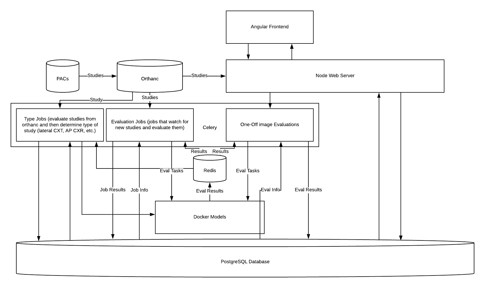
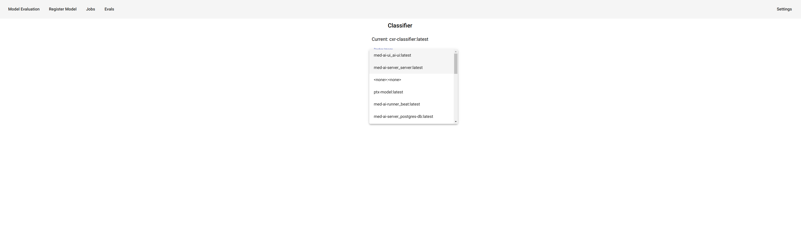
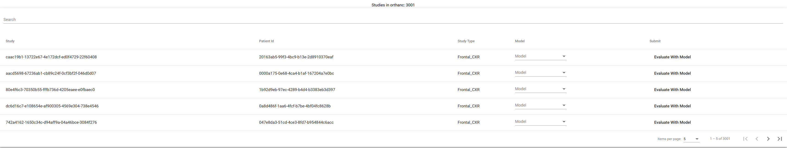
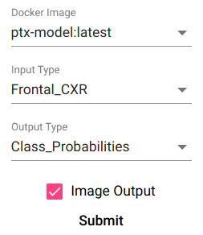

# med-ai

## Overview

## Installation
### Install git lfs
- ```curl -s https://packagecloud.io/install/repositories/github/git-lfs/script.deb.sh | sudo bash```
- ```sudo apt-get install git-lfs```
- ```git lfs install```
### Setup Nvidia Runtime
- Install docker from [here](https://docs.docker.com/engine/install/ubuntu/)
    - Make sure to add user to the docker group ([more info](https://docs.docker.com/engine/install/linux-postinstall/))
- Install nvidia drivers
- Install nvidia runtime using commands below (more info [here](https://github.com/NVIDIA/nvidia-docker#quickstart))
``` 
# Add the package repositories
distribution=$(. /etc/os-release;echo $ID$VERSION_ID)
curl -s -L https://nvidia.github.io/nvidia-docker/gpgkey | sudo apt-key add -
curl -s -L https://nvidia.github.io/nvidia-docker/$distribution/nvidia-docker.list | sudo tee /etc/apt/sources.list.d/nvidia-docker.list

sudo apt-get update && sudo apt-get install -y nvidia-container-toolkit
sudo systemctl restart docker
```
- Install nvidia-container-runtime
``` 
sudo apt install nvidia-container-runtime 
```
- Add the following file at ```/etc/docker/daemon.json```
```
{

    "runtimes": {
        "nvidia": {
            "path": "nvidia-container-runtime",
            "runtimeArgs": []
        }
    }
}
```
- Test that the setup is working with the following command
```
docker run --runtime=nvidia nvidia/cuda:10.0-base nvidia-smi
```
### Clone repository
```git clone git@github.com:tclarke104/med-ai --recursive-submodules```
### Build base model docker image
- Change directory to model image and build
- ```cd med-ai/med-ai-model```
- ```chmod +x ./build.sh```
- ```./build.sh```
### Build cxr classifier model image
- Change directory to model image and build
- ```cd med-ai/med-ai-cxr-classifier```
- ```chmod +x ./build.sh```
- ```./build.sh```
### Build ptx model image
- Change directory to ptx model image and build
- ```cd med-ai/med-ai-model-ptx```
- ```chmod +x ./build.sh```
- ```./build.sh```
### Start project
- ```cd med-ai```
- ```chmod +x ./start.sh```
- ```./start.sh```

## Architecture
- 

## Use
- Once started, the app can be accessed at localhost:4200
### Adding new studies to orthanc
- Once the app is started, navigate to ```localhost:8042```
- In the top right corner, select **upload**
- Upload studies (in dicom format) to dicom
- Refer to orthanc documentation on how to push dicoms to orthanc
### Selecting a classifier
- Navigate to settings tab
- 
- This is required to use the application!!
- Once a classifier is selected, the classified studies will start to appear on the **Studies** tab
- 
### Registering a model
- Once a docker image containing a model has been built, the model must be registered with the app for use
- Navigate to the **Register Model** tab
- Select the model, the expected input and output, and whether or not the model also outputs an image
- 
### Evaluating a single study with a model
- Once a model has been registered and a classifier has been selected, you can evaluate single studies on the **Studies** tab
- Results are shown on the **Evals** tab
### Turning on jobs
- The **jobs** tab allows you to evaluate all images in the dicom server using a given model
- When a job is checked in this tab, the backend will check orthanc for studies that have not yet been evaluated, and will queue tasks to evaluate the studies
- Results of job evaluations are shown on the **evals** tab

## Troubleshooting
### System Resources
- Depending the specs of your machine, the current settings may be too high or too low
#### Change Celery Concurrency
- Celery concurrency (the number of worker threads allowed) can be changed in ```med-ai/med-ai-runner/app/settings.py``` 
    - This can alleviate an overloaed GPU if decreased
